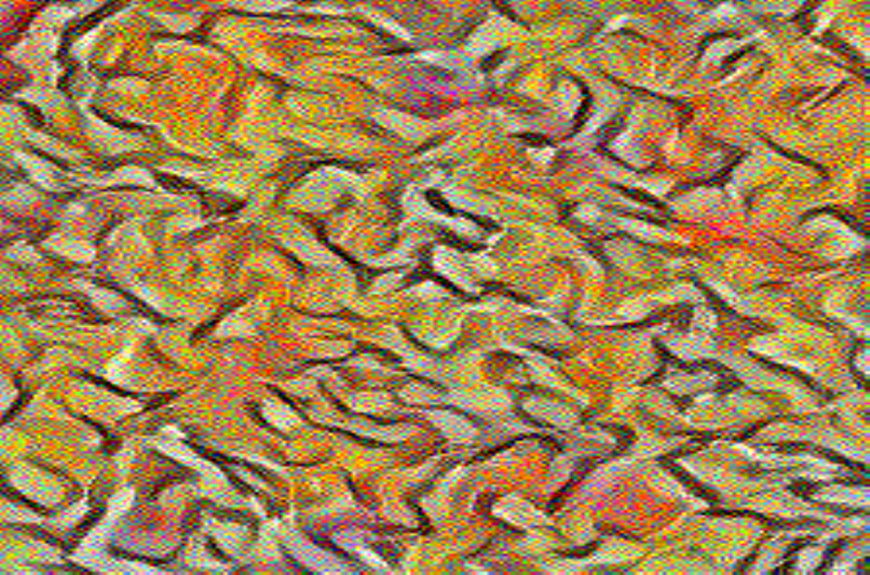

# A Neural Algorithm of Artistic Style

The implementation of VggNet was modified from [machrisaa's code](https://github.com/machrisaa/tensorflow-vgg), 2 weight files (vgg16 & vgg19) can also be found there. A simple adapter for npy reader is implemented too (so that the model can be trained on Google Cloud ML Engine).

## Flags

* **--content-weight**: weight for content loss (alpha).
* **--style-weight**: weight for style loss (beta).
* **--content-path**: path to the content image.
* **--style-path**: path to the style image.
* **--vgg19-path**: path to a npy file for weights of vgg.
* **--log-path**: log dir for TensorBoard.
* **--content-level**: target layer to extract content (0 ~ 5). No content if it's 0.
* **--style-level**: max layer to extract style (0 ~ 5). No style if it's 0.

## Result Path

The optimized image is not saved directly. It is displayed as a summary in TensorBoard.

## Experiments

